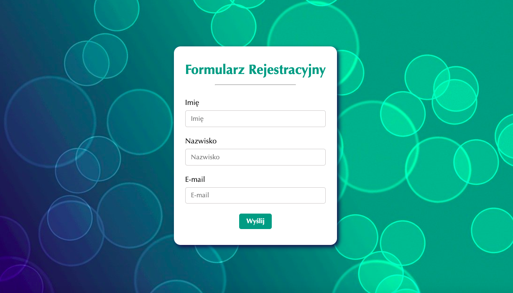

# Register Form 

This is a simple register form using vanilla JavaScript.

### Overview

This application is a simple web page that serves as a registration form. It combines HTML, CSS, and JavaScript to create a user-friendly registration form with validation and a pleasant user experience. Additionally, it introduces object-oriented programming principles by implementing a "Person" class and showcasing the creation and manipulation of objects in a list.

### Link

- Live preview: [https://register-form-basiakedz.netlify.app/](https://register-form-basiakedz.netlify.app/)

### Built with

- semantic HTML: Structuring the app's user interface.
- CSS with BEM: Styling the app's appearance.
- Vanilla JavaScript: Handling validation form and a welcoming success message is shown after successfully submitting the form. It introduces object-oriented programming principles by implementing a "Person" class and showcasing the creation and manipulation of objects in a list.

### How to Use

1. Clone this repository to your local machine.
2. Open the `index.html` file in a web browser.
3. Fill in register form with your name, last name and e-mail.
4. Click the "Wyślij" button to send a form.

